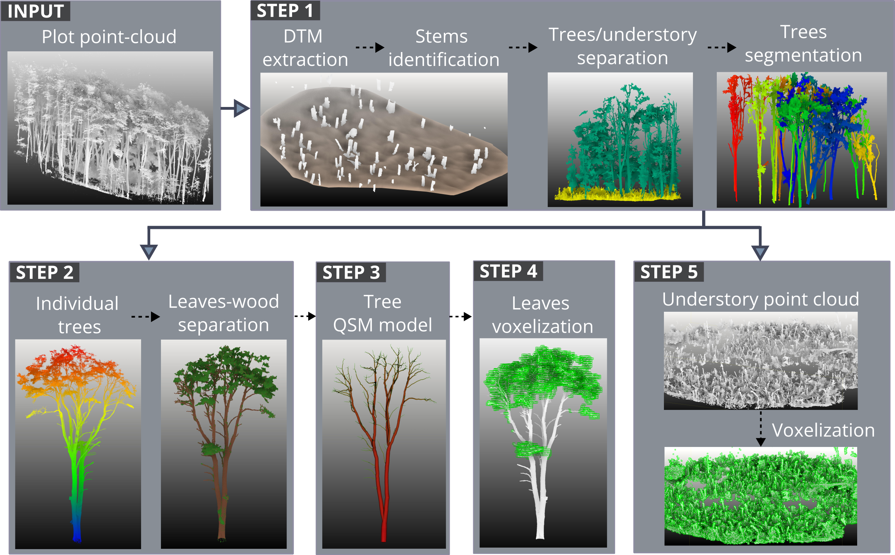

### **Overview**

This repository provides a complete, reproducible workflow for estimating aboveground biomass (AGB) from terrestrial laser scanning (TLS) data using freely available tools.

The pipeline integrates multiple processing steps, including tree segmentation, leaf–wood classification, quantitative structure modeling (QSM), and voxel-based analysis, to estimate biomass across different forest compartments (stems, branches, foliage, and understory).

*Updated: April 2026*

#### **Repository structure**

-   `1_sample_data/`: sample point cloud and a trained CANUPO classifier
-   `2_scripts/`: scripts to reproduce analysis
-   `3_results/`: example outputs
-   `4_supplementary_notes/`: additional documentation and script notes


#### **Reference and Citation**

(paper)

------------------------------------------------------------------------

### **Workflow description**


```{r, echo=FALSE, out.width="75%", fig.cap="", fig.align="left"}



```


#### **STEP 1**. Point Cloud Segmentation in Computree and SimpleForest

-   **Software:** Computree (v5) + SimpleForest
-   **Software documentation:** [Computree](https://computree.onf.fr/?page_id=42) - [SimpleForest](https://simpleforest.org/)
-   **Script**:
    -   [*1_COMPUTREE_SEGMENTATION_PIPELINE.xsct2*](https://github.com/romina-gonzalez-musso/patagonia-tls-workflow/tree/main/2_scripts)
-   **Script notes**: [See Supplementary Information](https://github.com/romina-gonzalez-musso/patagonia-tls-workflow/blob/main/4_supplementary_notes/1_Computree_notes.md)

#### **STEP 2**. Leaves-wood separation

-   **Software:** CANUPO through CloudCompare
-   **Software documentation:** [CANUPO](https://www.cloudcompare.org/doc/wiki/index.php/CANUPO_(plugin)) - [CloudCompare](https://www.cloudcompare.org/)
-   **Script**:
    -   [*2_Leaves_wood_sep_CC_CANUPO_R.R*](https://github.com/romina-gonzalez-musso/patagonia-tls-workflow/blob/main/2_scripts/2_Leaves_wood_sep_CC_CANUPO_R.R)
-   **Script notes**: manual inspection and editing in CloudCompare may be required to address potential classification errors and improve the quality of the resulting point clouds.

#### **STEP 3**. Tree QSM modeling

-   **Software:** Computree (v5) + SimpleForest
-   **Software documentation:** [Computree](https://computree.onf.fr/?page_id=42) - [SimpleForest](https://simpleforest.org/)
-   **Script**:
    -   [*3_QSM_modeling_single_tree.xsct2*](https://github.com/romina-gonzalez-musso/patagonia-tls-workflow/tree/main/2_scripts)
-   **Script notes**: [See Supplementary Information](https://github.com/romina-gonzalez-musso/patagonia-tls-workflow/blob/main/4_supplementary_notes/2_Computree_notes.md)

#### **STEP 4**. Leaves/Crown voxelization

-   **Software:** VoxR / ITSme
-   **Software documentation:** [VoxR](https://academic.oup.com/aob/article/121/4/589/4107549) - [ITSme](https://besjournals.onlinelibrary.wiley.com/doi/full/10.1111/2041-210X.14026)
-   **Script**:
    -   [*4_Canopy_Crown_voxel.R*](https://github.com/romina-gonzalez-musso/patagonia-tls-workflow/blob/main/2_scripts/4_Canopy_Crown_voxel.R)

#### **STEP 5**. Understory voxelization

-   **Software:** VoxR / lidR
-   **Software documentation:** [VoxR](https://academic.oup.com/aob/article/121/4/589/4107549) - [lidR](https://www.sciencedirect.com/science/article/pii/S0034425720304314)
-   **Script**:
    -   [*5_Understory_voxel.R*](https://github.com/romina-gonzalez-musso/patagonia-tls-workflow/blob/main/2_scripts/5_Understory_voxel.R)

------------------------------------------------------------------------

### **NOTES**

-   The workflow combines multiple open-source tools. Some steps may require manual parameter tuning depending on forest structure and data quality.

-   Recommended parameter settings were calibrated for *Nothofagus* dominated Patagonian forests and may require adjustment for other forest types.

-   This repository includes sample data to demonstrate the workflow, but users should adapt parameters to their own datasets.

------------------------------------------------------------------------
### **SOFTWARE REFERENCES**

- L. Terryn, K. Calders, M. Åkerblom, H. Bartholomeus, M. Disney, S. Levick, N. Origo, P. Raumonen, H. Verbeeck. Analysing individual 3D tree structure using the R package **ITSMe**. Methods Ecol Evol 14 (2023) 231–241. [Link](https://doi.org/10.1111/2041-210X.14026)

- J.-R. Roussel, D. Auty, N.C. Coops, P. Tompalski, T.R.H. Goodbody, A.S. Meador, J.-F. Bourdon, F. De Boissieu, A. Achim. **lidR**: An R package for analysis of Airborne Laser Scanning (ALS) data. Remote Sensing of Environment 251 (2020) 112061. [Link](https://doi.org/10.1016/j.rse.2020.112061)

- J. Hackenberg, H. Spiecker, K. Calders, M. Disney, P. Raumonen. **SimpleTree** —An Efficient Open Source Tool to Build Tree Models from TLS Clouds. Forests 6 (2015) 4245–4294. [Link](https://doi.org/10.3390/f6114245)

- B. Lecigne, S. Delagrange, C. Messier. Exploring trees in three dimensions: **VoxR**, a novel voxel-based R package dedicated to analysing the complex arrangement of tree crowns. Annals of Botany 121 (2018) 589–601. [Link](https://doi.org/10.1093/aob/mcx095)

- **CloudCompare** (version 2.13.2). (2025). GPL Software. [Link](http://www. cloudcompare.org/)

- N. Brodu, D. Lague. 3D Terrestrial lidar data classification of complex natural scenes using a multi-scale dimensionality criterion: applications in geomorphology (**CANUPO**). (2012) [Link](http://arxiv.org/abs/1107.0550)


